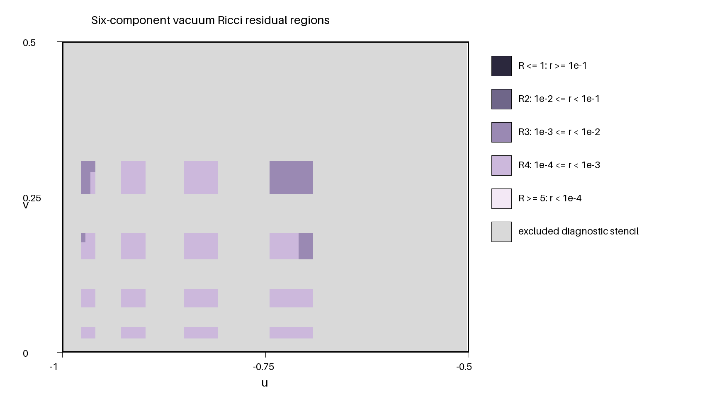

# Experiment 5: vacuum crossed pulses

## Setup

Mild outgoing and incoming shears of amplitude 0.1 are evolved slab by slab on
six degree-ten square-root elements in each null direction. The angular space
uses \(L=8,W=14\) and 300 points. Each slab receives up to 30 sweeps.

## Result

All six slabs settle, with final weighted updates between
\(1.85\times10^{-9}\) and \(7.82\times10^{-9}\). The protected six-component
residual is 0.00517008, the minimum metric eigenvalue is 0.03160, and all 13
state/residual arrays plus 865 scalar summary values are bitwise identical in
the same-grid validation.

The gray region is excluded by derivative and interface stencils. Colored
cells are classified without interpolation across spectral-element
interfaces.
