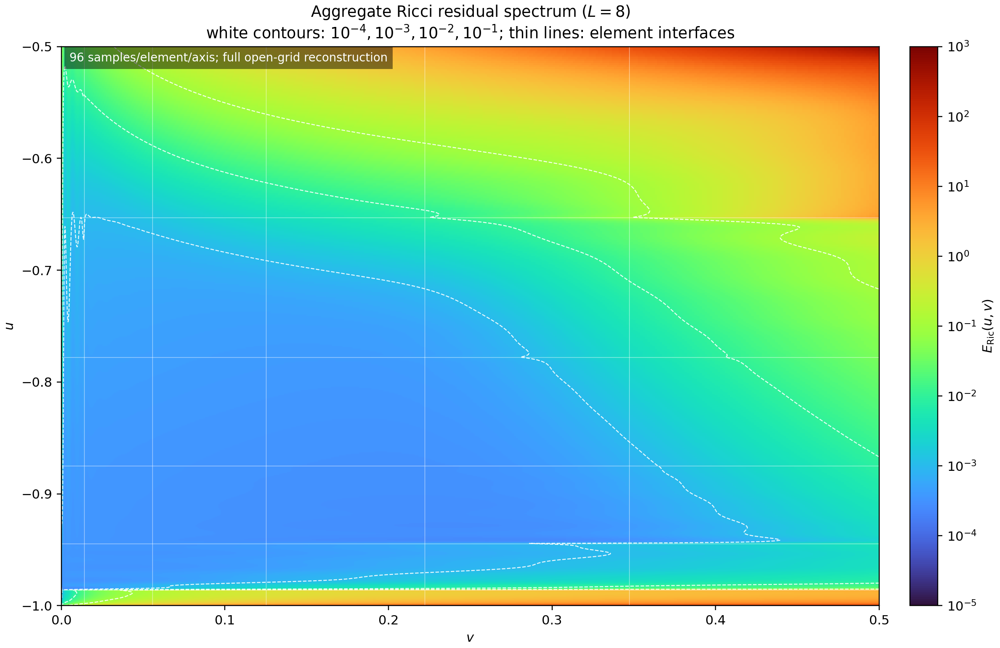

# Experiment 5: vacuum crossed characteristic shears

## Setup

The initial shears satisfy
\(\Omega\widehat\chi(-1,v)=v^{1/2}\mathcal T_{X_1}[g]\) and
\(\Omega\widehat{\underline\chi}(u,0)=(u+1)^{1/2}\mathcal T_{X_2}[g]\).
They vanish continuously at the corner, but their transverse derivatives
diverge. Consequently both \(R_{4A4B}\) and \(R_{3A3B}\) are infinite at the
corner in the limiting sense. The data are evolved slab by slab on six
degree-ten square-root elements in each null direction. The angular space uses
\(L=8,W=14\) and 300 points. Each slab receives up to 30 sweeps.

## Result

All six slabs settle, with final weighted updates between
\(1.85\times10^{-9}\) and \(8.69\times10^{-9}\). The six terminal updates are
\(1.850,4.897,8.694,4.404,6.984,4.761\times10^{-9}\). The protected
six-component residual including the 44 equation is 0.00508699, and the
minimum `g` eigenvalue is 0.0293816. All immutable incoming and outgoing traces
are restored exactly after each slab sweep, up to a
\(1.78\times10^{-15}\) incoming `Omega_trchi` roundoff error.

Colors show the elementwise spectral interpolation of the full open-grid
six-component residual sum. White contours mark \(10^{-4},10^{-3},10^{-2}\),
and \(10^{-1}\), while the thin lines mark coordinate-element interfaces.
The large endpoint layers are displayed but are excluded from the protected
interior accuracy statistic.
