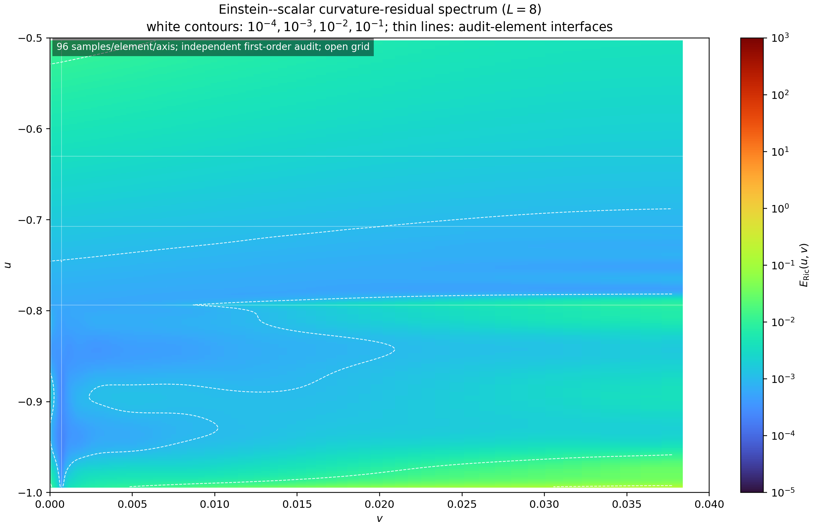

# Experiment 7: nonspherical scalar data

Smooth angular lapse, shift, shear, and scalar free data are completed by the
Einstein-scalar characteristic constraints on \([-1,-1/2]\times[0,0.04]\).
The angular profiles use the analytic fields \((3z^2-1)/2\),
\(\nabla(xz)\), and the trace-free Hessian of \(x^2-y^2\), with fixed
normalizations independent of the sampled sphere points.

Coordinate levels use degrees (6,9), (8,11), and (8,11) with two, two, and
three elements. Angular levels use retained/work degrees and point counts
(6,12,200), (8,16,350), and (10,20,550). Six sweeps precede a rotated control
and stress matrix. The full weighted state is resampled before the independent
first-order Einstein-scalar audit. Typed angular transfer retains the geometric
vector/tensor modes. All refinement cases share a coordinate audit grid formed
from the union of their element boundaries, with degrees (11,14). The protected
region requires s>=0.6 and excludes endpoint and interface halos, giving the
same 198 sections in each coordinate comparison. Metric/scalar consistency is checked
separately.

Two designated extreme stress probes test rejection of a negative incoming
scalar-constraint radicand. They are recorded as expected rejections; other
failures and a failed refinement gate cause the aggregate to fail.

See the regenerated [table](../../article/tables/exp07-rows.tex),
[provenance](../../article/tables/exp07-statistics.json), and
[revision report](../revision-2026-09-08.md).

