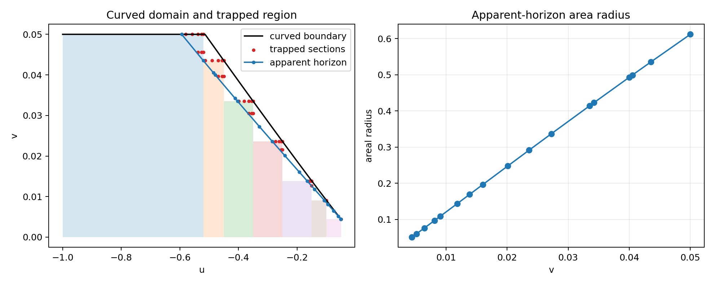

# Experiment 8: scalar trapped region and apparent horizon

The scalar pulse has kappa=0.25, delta=0.1, scale 0.01, amplitude -2,
and an axisymmetric weighted-shear perturbation of amplitude 0.1. Its tensor
profile is minus the trace-free round-sphere Hessian of z squared; it differs
from Experiment 7's nonaxisymmetric tensor. The incoming scalar constraint
uses its negative branch.

Seven nested rectangles form an inner atlas of
\(v\le\min(0.1(-u)^{25/24},0.05)\), \(-1\le u\le-0.05\).
Their right boundaries are -0.52, -0.45, -0.35, -0.25, -0.15, -0.10, and -0.05.
Overlaps compare the computed primitives. Further support patches and
coordinate-refined anchor patches support the graph horizon calculation.
The separate 300-point angular control tests the refined anchor near v=0.04.

The curvature audit uses independently resampled first-order weighted fields.
The coordinate trapped-section scan evaluates both null expansions on 1000
sphere points. Graph expansions are reconstructed from the primitive metric
connection and angular embedding. Accepted MOTSs require solver success,
positive patch-interior margin and area, an outgoing expansion residual at
most 1e-5, strictly negative incoming expansion, and a displaced-section sign
bracket. Rejected attempts are retained. The degree-three trace is diagnostic
only. Starting from the outermost detected constant-section bracket does not
prove outermostness among arbitrary angular graphs.

See the regenerated [table](../../article/tables/exp08-rows.tex),
[provenance](../../article/tables/exp08-statistics.json), and
[revision report](../revision-2026-09-08.md).

