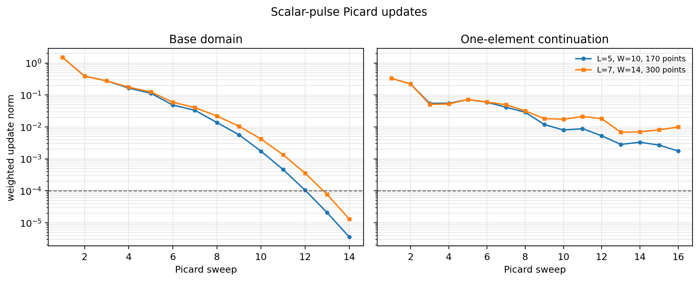
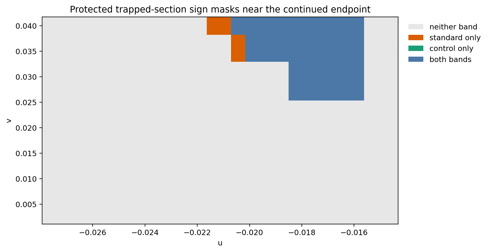

# Experiment 8: scalar trapped-section formation

## Setup

The power-law scalar pulse uses \(\kappa=0.25\), \(\delta=0.1\), scale 0.01,
scalar amplitude 2, and quadrupolar shear amplitude 0.1. A 12-element
degree-eight tau domain is extended by one whole element through exact-prefix
prolongation; the transverse direction has three degree-eleven elements. The
standard band is \(L=5,W=10,N=170\), and the control is
\(L=7,W=14,N=300\). Both independently resample the two expansion suprema on
1000 sphere points with a three-node endpoint halo.

## Fresh result

The base updates reach \(3.58\times10^{-6}\) (standard) and
\(1.32\times10^{-5}\) (control). Continued updates remain
\(1.76\times10^{-3}\) and \(9.90\times10^{-3}\). The standard/control protected
sign masks contain 18/16 cells; all 16 control cells occur in the standard
mask, with two additional standard cells. Boundary hashes remain unchanged,
fixed-face mismatches stay below \(3.34\times10^{-13}\), and the lapse remains
positive in every sweep.

## Limitation

The protected independent ESE residuals are \(9.64\times10^3\) and
\(6.98\times10^3\). Neither run satisfies the update or residual gate, and no
coordinate-refinement certificate is present. The overlapping negative-sign
region is therefore an uncertified observation, not a trapped-section
candidate or high-precision certificate.
